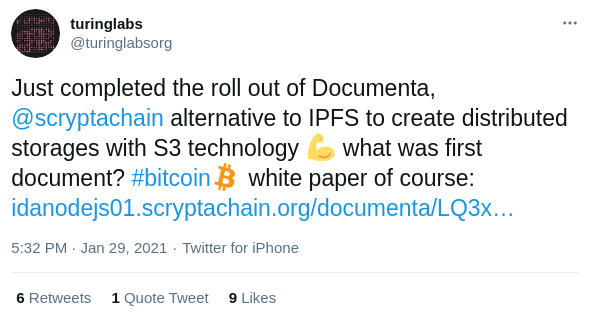

# TweetShot

Tweetshot is a simple tool to create screenshot of tweets and organize them into folders with a simple terminal command.

## How to use it

Install dependencies first, make sure you have NodeJS installed:

```
npm install -g @turinglabsorg/tweetshot
```

## Screenshot a tweet

```
tweetshot -t=https://twitter.com/turinglabsorg/status/1355191990728749057
```

Following example will create this file:

